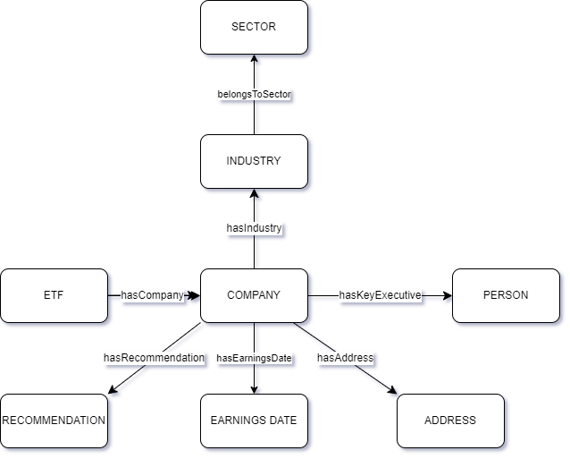

# finance-kg

## Overview
This project aims to create a finance knowledge graph focusing on companies, industries, and sectors within ETFs. The knowledge graph is constructed using data gathered from various sources and organized in a structured format to facilitate analysis and comparison.

## Data Sources
- **yfinance Library**: The primary data source used for gathering information on companies, including ticker symbols, financial data, and other relevant details. More information about the yfinance library can be found [here](https://github.com/ranaroussi/yfinance).
- **Yahoo Finance API Guide**: Additional insights into utilizing the Yahoo Finance API were obtained from the guide provided by Algotrading101 blog. The guide covers various aspects of the Yahoo Finance API and can be accessed [here](https://algotrading101.com/learn/yahoo-finance-api-guide/).
- **iShares ETFs**: Data on ETFs, including composition and holdings, was sourced from iShares, a product group by BlackRock. More information about iShares ETFs can be found [here](https://www.ishares.com/us).
- **OpenFIGI API**: The Financial Instrument Global Identifier (FIGI) API was utilized to retrieve ticker symbols based on International Securities Identification Numbers (ISINs), facilitating the gathering of ticker data specifically for companies listed on US exchanges.More information about the OpenFIGI API can be found [here](https://www.openfigi.com/api).

## Methodology
1. **Data Acquisition**: Company data, including ticker symbols and financial metrics, was collected using the yfinance library.
2. **Preprocessing**: The collected data underwent preprocessing steps to clean and structure it for integration into the knowledge graph.
3. **Graph Construction**: The knowledge graph was constructed using RDF triples to establish relationships between entities such as companies, industries, and sectors.
4. **Query Formulation**: Various queries were formulated to analyze and extract insights from the knowledge graph, focusing on aspects such as company distribution, sectoral trends, and geographical representation.

## Results and Analysis
- The results obtained from the knowledge graph provide insights into the composition of ETFs, including the distribution of companies across different sectors and countries.
- Analysis of the data revealed certain inconsistencies and limitations, highlighting the need for further refinement and data enhancement techniques.
- Queries formulated from the knowledge graph yielded valuable insights into the relationships between companies, industries, and sectors within ETFs, paving the way for more in-depth analysis and comparison.

## Future Work
- Enhance Data Consistency: Address inconsistencies and limitations in the data through improved preprocessing techniques and the use of official APIs.
- Incorporate Company Weight: Include the weight of each company within ETFs to facilitate more accurate comparisons of sectoral distributions.
- Expand Knowledge Graph: Continuously update and expand the knowledge graph with new data and insights to enhance its utility and relevance.

## References
- Ran Aroussi. (n.d.). yfinance GitHub Repository. Retrieved from [https://github.com/ranaroussi/yfinance](https://github.com/ranaroussi/yfinance)
- Bland, G. (2021, Jan). Yahoo Finance API - A Complete Guide. Algotrading101 Blog. Retrieved from [https://algotrading101.com/learn/yahoo-finance-api-guide/](https://algotrading101.com/learn/yahoo-finance-api-guide/)
- FIGI API Documentation. Retrieved from [https://www.openfigi.com/api](https://www.openfigi.com/api)

